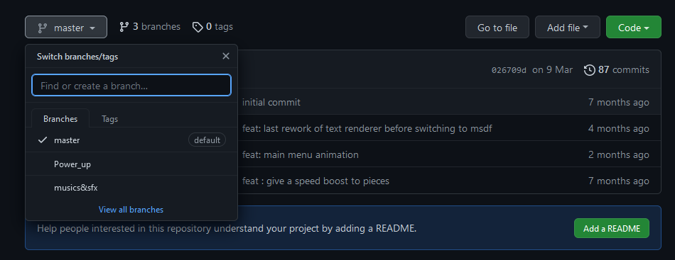

# Git


## Une introduction

### Qu'est-ce que c'est ?
Git est un outil de gestion de versions, il permet de synchroniser des fichiers entre plusieurs personnes et de garder un historique des modifications.


### Qu'est-ce que ce n'est pas
Git est très pratique pour les projets à plusieurs mais il ne résout pas tout. Ce n'est pas une solution miracle - vous aurez encore beaucoup de travail à faire par vous même.
Vous avez sans doute déjà entendu parler de [github](https://github.com), [gitlab](https://gitlab.com), [bitbucket](https://bitbucket.com) ou d'autres, ce sont des sites webs qui hébergent vos projets git et vous permettent de les parcourir simplement. *Mais il n'y a pas besoin de github (ou un autre) pour que git soit utile !* En soit ce sont juste des clouds de stockage.
Retenez que git&ne;github, git c'est l'outil, github c'est l'interface.

> Personnelement j'utilise github, mais vous pouvez utiliser ce que vous voulez, les commandes git sont exactement les mêmes.


## Comment s'en servir
### Comment fonctionne git

Git fonctionne avec des <u>repository</u>. Un dossier peut être un *répo* git, dans ce cas là il contient un dossier caché `.git` auquel il ne faut jamais toucher. C'est dans un répo que vous avez accès aux fonctionnalités de git.

> J'utilise "répo" à la place de repository, c'est juste le nom contracté.

Techniquement un répo tout seul peut déjà servir, mais c'est mieux si vous n'êtes pas seul à y avoir accès, donc on en fait une copie sur un serveur en ligne (typiquement github), ensuite d'autres peuvent *cloner* le répo et le modifier.
Donc en tout il y a le répo "maître" qui est sur github plus un par utilisateur. D'ailleur c'est souvent plus simple de créer le répo en ligne en premier et d'en faire soi-même un clone.

Maintenant que le répo existe, on peut y travailler, modifier des fichiers etc. Pour que les autres voient les modifications il faut d'abord dire à git "j'ai modifié ça" et ensuite envoyer les modifications vers github. De leur côté les autres pourront utiliser git pour récupérer les modifs.

Git fonctionne avec des <u>commit</u>. Une fois que vous avez modifié quelque chose, il faut rassembler les modifications en commit et c'est le commit qui sera envoyé/reçu par/vers github.

> [!tldr] Vocab
> 
> - **repository** - ensemble de fichiers géré par git
> - **commit** - ensemble de modifications sauvegardées
> - **remote** - le répo git distant (sur github), c'est le repository principal de votre projet
> - **local** - le répo git local (sur votre ordi, il peut y en avoir plusieurs)
> - **staged** - un fichier est "staged" si git l'a sauvegardé mais qu'il n'est pas encore dans un commit
> - **branch** - cf [[git-course#Les branches|les branches]]
> - **head** - le dernier commit local (sur la branche active)
> - **pull** - récupérer les modifications des autres depuis le remote
> - **push** - envoyer ses propres modifications vers le remote

### Git depuis la shell

> [!tldr] Rappels sur la shell
> 
> La shell (terminal/command line/user prompt/powershell/invité de commande...) est un outil du développeur qui peut à peu près tout faire, mais sans interface.
>  On en aura un usage assez basique, si vous ne l'avez jamais utilisé dites vous que c'est un "explorateur de fichiers très évolué". Démarrez une shell, tapez `pwd` pour savoir où vous êtes, utilisez `ls` pour lister les fichiers de votre emplacement, `cd ..` pour revenir un dossier en arrière ou `cd truc` pour aller dans le dossier truc.
>  
>  

#### La partie simple

Pour apprendre git, le plus simple c'est de commencer par la ligne de commande. Il existe des interfaces graphiques que vous pourrez utiliser plus tard...

> [!info] 0 - Préparation
> 
> Pour utiliser git dans tous les cas il faut vous placer au bon endroit avant de commencer. Utilisez la commande `cd` ou démarrez votre shell dans le dossier du répo directement.
> 
> La première fois que vous utilisez git, faite 
> ```
> git config --global user.name "˂votre nom˃"
> git config --global user.email "˂votre mail˃"
> ```
> à noter que votre mail doit correspondre à celui de votre compte github.

> [!example] 1 - Créer un nouveau répo
> 
> Pour avoir un repository, on peut soit en *cloner* un existant :
> ```
> git clone ˂url˃
> ```
>  Soit en créer un nouveau :
> ```
> git init
> ```
> > La commande clone créé un nouveau dossier dans lequel votre répo habitera, init utilise le dossier dans lequel vous êtes déjà
>
> Pour l'exercice, vous pouvez cloner le répo à l'url suivante : [TODO](https://TODO)
> Git vous affichera un message de succès ou un message pour vous dire quoi faire.

> [!example] 2 - Modifier des trucs
> 
> Vous pouvez créer un fichier avec votre nom-prénom et le remplir avec ce que vous voulez, vous aurez à le remodifier plus tard.
> 
> Après ça faites
> ```
> git status
> ```
> pour voir l'ensemble des fichiers modifiés/créés/supprimés. Vous pouvez aussi faire
> ```
> git diff
> ```
> pour voir la différence entre le dernier commit et vos fichiers locaux.

> [!example] 3 - Le commit
> 
> Pour dire à git "j'ai fait ça et j'en suis fier !", il faut faire un *commit*. D'abord faites
> ```
> git add ˂edited files...˃
> ```
> pour que les fichiers deviennent *staged*. Pour tout ajouter d'un coup vous pouvez faire `git add .`
> 
> > Vous pouvez refaire un `git status` pour voir la différence.
> 
> Ensuite faites
> ```
> git commit -m "˂commit message˃"
> ```
> vous pouvez aussi ne pas mettre le `-m "..."` mais votre shell vous demandera un message de commit.
> > Vous pouvez encore refaire un `git status` pour voir la différence.
> > Et si vous faites `git log` vous pourrez voire votre commit (*head*) en avance sur le remote

> [!example] 4 - Le pull
> 
> Avant d'envoyer ses modifications vers github, il faut *toujours* récupérer les modifications des autres *avant*. De toute façon git vous le dira si vous ne l'avez pas fait. Pour ca vous pouvez faire
> ```
> git pull
> ```
> Git va vous afficher une liste des fichiers qui ont été modifiés.
> 
> > C'est souvent une bonne idée de faire un pull *avant* de commencer à travailler, pour avoir la dernière version du projet.

> [!example] 5 - Le push
> 
> Une fois que votre repository est synchronisé avec le remote vous pouvez faire
> ```
> git push
> ```
> Si git vous répond "out of sync" ou quelque chose du genre c'est que quelqu'un à push avant vous ! Allez lui dire qu'il n'est pas gentil et retournez à l'étape 4.

> TLDR :
> 1. git add
> 1. git commit
> 1. git pull
> 1. (git push)
> 1. repeat
> C'est la boucle normale de développement. On l'affine avec les branches, les pull requests...

#### Les merges

Très vite quand vous allez pull/push git va vous dire "error \[...\] files would be overwritten by merge", ça veut dire que vos fichiers sont en conflicts avec les fichiers du répo principal.

Dans ce cas il vous faut résoudre les conflits vous même, commencez par *add*, *commit* vos fichiers et re-*pull* s'il vous restait des fichiers hors commit. Ensuite dans les fichiers en conflits 

#### Les branches

Les *branch*es sont des espaces parallèles de développement. Elles peuvent  servir pour séparer les avancées de chaque personne, permettre des expérimentations qui peuvent être intégrées au projet ou rejetées etc.

Chaque repository possède une branche par défaut, souvent `master`. C'est la branche sélectionnée par défaut. Vous pouvez voir la branche active avec la première ligne du `git status`.



Concrètement, une branche est une *version* du repository, qui contient des commits et qui peut être modifiée sans affecter les autres. Je vous propose de les utiliser pour pouvoir push vos modifications sans affecter les autres et quand vous serez prêt vous pourrez fusionner votre branche et la branche principale.

Pour lister les branches :
```
git branch
```
Pour créer une branche :
```
git branch <branch name>
```
Pour se déplacer sur une branche :
```
git checkout <branch name>
```
Quand vous faites un *checkout* d'une autre branche, vos fichiers sont modifiés pour devenir ceux de la branche. De la même manière, les commits sont séparés entre les branches.
Pour voir l'historique complet des branches vous pouvez utiliser :
```
git log --oneline --reflog --graph
```
Pour fusionner une branche à une autre, d'abord placez vous sur la branche qui *reçoit* les modifications (`checkout`) puis faites :
```
git merge <branch name>
```
Avec le nom de la branche qui *possède déjà* les modifications (les commits).
Lorsqu'une branche n'est plus utilisée vous pouvez la supprimer depuis github et en local :
```
git branch -d <branch name>
```
ça rend le répo un peu plus propre. Les commits qui ont été *merge* ne seront pas perdus.

> [!info] Bonne pratique
> 
> En début de projet mettez vous d'accord sur l'utilisation des branches, une solution simple est que chacun ait sa branche.
> Il y a aussi beaucoup de projets ou les branches ne sont pas nécessaires, si le projet n'est pas très grand vous pouvez vous permettre de travailler sur la branche principale.

#### Le .gitignore

TLDR : Prenez le .gitignore qui correspond à votre langage & IDE et rajoutez le avant au projet tout le reste.

Dans vos projets il y a des fichiers que vous voulez synchroniser et d'autres non, vous avez deux choix : éviter de les ajouter à vos commits à chaque fois ou utiliser un `.gitignore`.

Vous pouvez avoir un .gitignore dans chaque dossier de votre répo, ils permettent d'exclure des fichiers. Par exemple :

```gitignore
# le dossier "config"
config

# tous les fichiers/dossiers "node_modules" et "package-lock.json"
**/node_modules
**/package-lock.json

# tous les fichiers en .png, peu importe ou
*.png

# tous les .txt du dossier "output" 
output/*.txt
```

> [!info] Bonne pratique
> 
> De manière générale, ajoutez *toujours* vos fichiers de configuration d'IDE au .gitignore, ça permet aux autres d'utiliser d'autres IDE et ça peut poser problème entre différentes configurations.
> > Il m'est arrivé d'avoir à modifier un fichier à chaque commit parce que la version de Java n'était pas la même sur mes deux machines ; évitez vous ça.

Normalement vous avez des exemples de .gitignore à côté de ce fichier. Vous pouvez aussi en trouver des plus ou moins complets [ici](https://github.com/github/gitignore).

> [!attention] Attention
> 
> Si vous rajoutez un fichier au .gitignore mais qu'il est déjà dans un commit il faudra faire `git rm --cached <fichier>` et faire un nouveau commit. Ca supprimera le fichier de ceux qui vont pull ensuite, pensez à faire une sauvegarde ou à aller le récupérer dans l'historique git.
> Pour éviter ça mettez un .gitignore **dès le début du projet**.

## Problèmes courants

- En début de projet vérifiez toujours que vous êtes sur la branche principale, ça peut poser beaucoup de problèmes sinon.
- Si votre IDE ne reconnaît pas votre projet après un pull, vérifiez que le gitignore contient bien les fichiers de configurations et qu'ils ne sont pas déjà sur la branche principale.
- Au début d'un projet, si vous ne pouvez pas pull/push c'est peut-être un problème de remote, dans ce cas utilisez `git push -u origin/master` (si origin est votre remote et master la branche principale).
- Si vraiment git vous dit non, une solution est de re-cloner le projet dans un nouveau dossier (gardez toujours l'ancien, au cas ou)

## Notes

> [!tldr] Commandes essentielles
> 
> ```
> git init
> git clone ˂url˃
> git status
> git log --oneline
>
> git add ˂files...˃
> git add .
> git commit -m "˂message˃"
> 
> git pull
> git push
>
> git branch
> git branch ˂branch˃
> git checkout ˂branch˃
> git branch -d ˂branch˃
>
> git merge ˂branch˃
> ```

[Cheat-sheet git](https://training.github.com/downloads/github-git-cheat-sheet.pdf)

Après un commit il n'est pas strictement nécessaire de push, vous pouvez accumuler des commits en push plusieurs d'un coup, ça peut être une bonne idée si vous avez cassé quelque chose dans le projet par exemple. Il vaut toujours mieux attendre que de push des modifications qui vont gêner les autres, ou alors push sur une branche annexe.

### Erreurs de commit
- Vous avez déjà `git add` votre fichier mais pas encore commit :
  ```
  git rm --cached <file>
  ```

- Vous avez déjà `git commit` un fichier mais pas encore push :
  ```
  -- réparez votre fichier, puis
  git add <file>
  git commit -m "<message>" --ammend
  ```
  Ça ne marche que si le fichier fait parti de votre dernier commit.

- Vous avez déjà push :
  Pas de chance, l'historique git est inaltérable, il ne vous reste plus qu'à refaire un commit et espérer que ça n'a gêné personne.

- Vous avez fait des modifications mais qui ne valent pas la peine d'être gardées, pour revenir aux fichiers tels qu'ils étaient au dernier commit :
  ```
  git reset --hard
  ```
  **Attention**, cette action n'est pas réversible !
  
Si votre cas n'est pas dans la liste, vous pouvez regarder [ici](https://docs.gitlab.com/ee/topics/git/numerous_undo_possibilities_in_git/)
