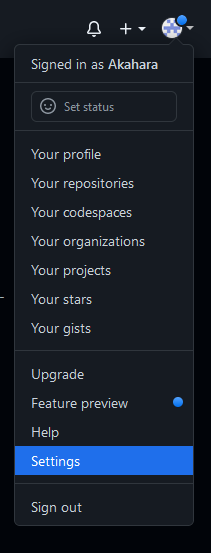
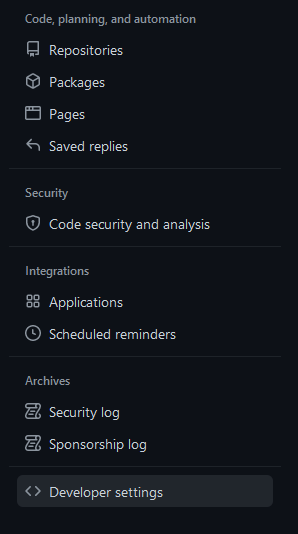
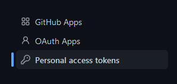
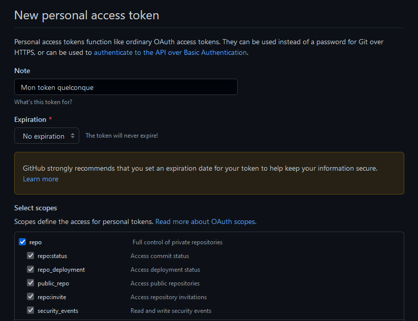
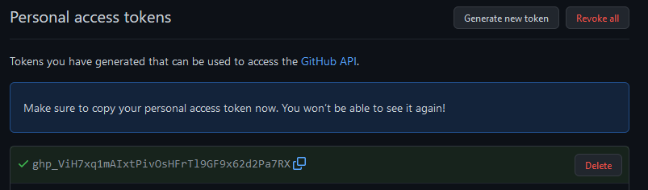

## Les Tokens de connection

Au bout d'un moment vous voudrez peut-être integrer git à votre IDE, il y a 11 chances sur 10 qu'il vous demande de vous connecter, et depuis ~2019 il vous faut un *token* pour vous connecter.

Les *tokens* github sont simplement des mots de passe très longs qui périment. Vous pouvez les créer depuis github uniquement :

    

Vous n'aurez surement pas besoin de cocher plus de cases, au pire vous pourrez toujours recréer un token.
Comme dit github, créer un token à durée de vie illimitée n'est pas conseillé mais bon...

Et **surtout** notez le token !! C'est très pénible d'avoir à en recréer un à chaque fois qu'on oublie le dernier.
Ensuite quand votre IDE vous demandera votre *mot de passe*, il faudra utiliser votre token, et *pas* votre mot de passe github.