Here is an example of a git use-case. I created a repository on github (test.git) and cloned it. The default branch was named *main* instead of the usual *master*.

> **Clone**
> 
> 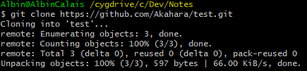

> **Add a file**
> 
> 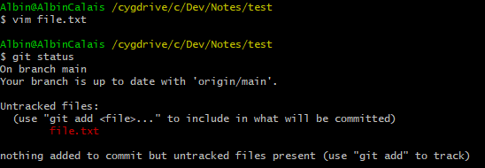

> **Stage the file**
> 
> 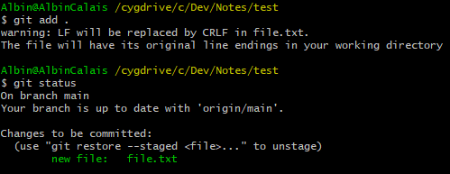

> **Commit**
> 
> 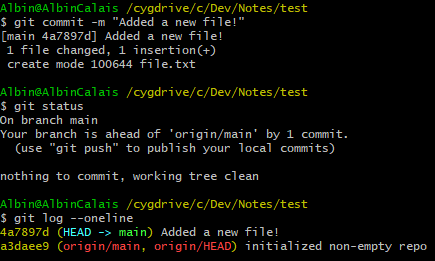

> **Push**
>
> 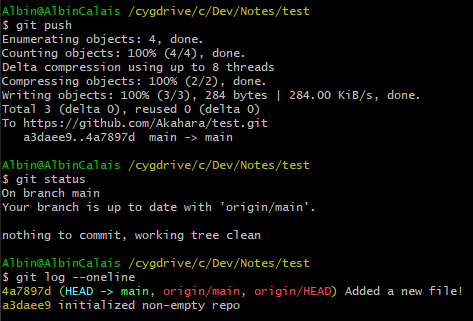

> **Switch to a new branch**
> 
> 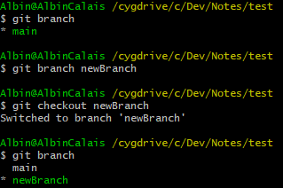

> **Remove the file**
> 
> 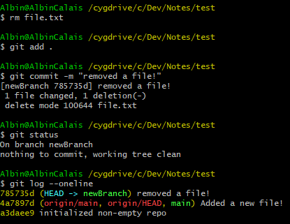

> **Merge the 2 branches** 
> 
> 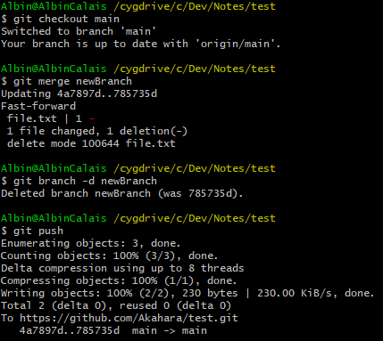

> **Pull with a conflict**
> 
> I created a file named *conflict.txt* and someone else also did, we both wrote a single line and git does not know how to handle the situation, it gives me a merge conflict that I have to resolve myself.
> 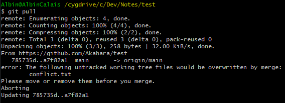
> To start resolving the conflict, we must first commit what was not commited.
> 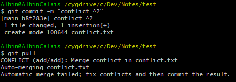
> The conflicting file :
> 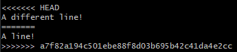
> conflicts are marked with <<< and >>>, above the \=\=\= line is the current file and below is the file as it is currently on the remote.
> To fix the conflict you can do whatever, keep both parts, remove one or both... *Never leave the <<< \=\=\= and >>> lines!*

> **To finish fixing the conflict, commit one last time**
>
> 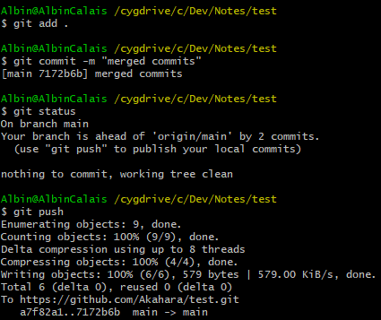