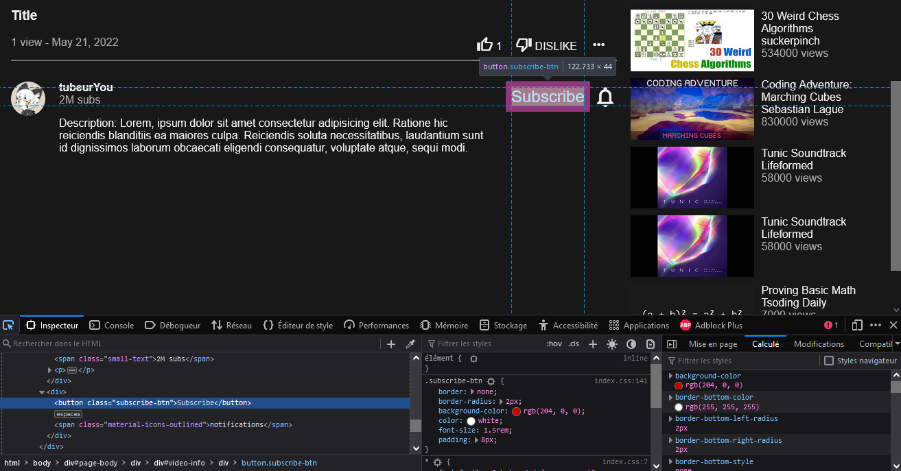
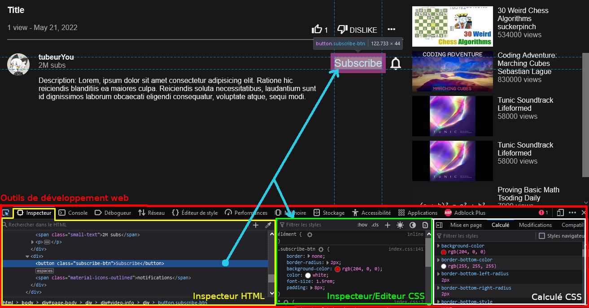
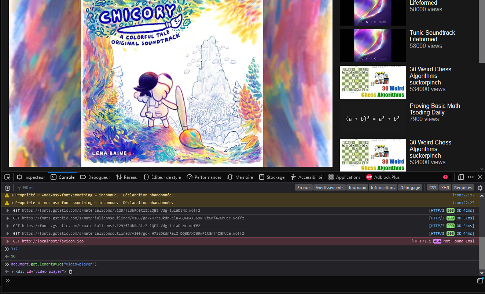
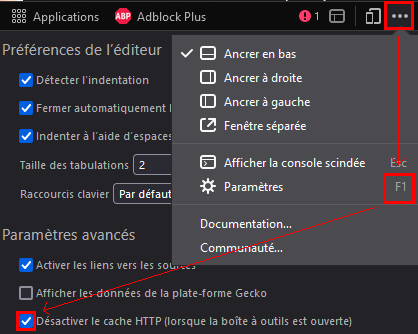
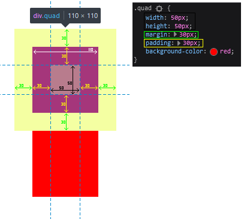

# Développement web

Un "cours" qui traite de tous les aspects du web nécessaires pour réaliser un site.

## Table des matières

Certains blocks ont été masqués.

{{TOC}}

## Intro

Avec ce "cours" je compte vous apprendre à vous servir d'html, css, php et javascript (js) pour construire un site web complet. Je n'ai pas besoin de vous expliquer à quel point le web est important... duh. Et savoir faire ça est très pratique, surtout pour la création d'interfaces - vous pouvez toujours utiliser d'autres langages style Java, c++ etc pour créer des interfaces mais le web est *fait pour* ; même dans vos autres projets passer par html/css est souvent très pratique.

### Comment ça marche, le web ?

A première vue il faut déjà différencier le client (le navigateur web) et le serveur (le site web). Le client va sur le site, demande une page web et tout ce qui va avec et le serveur lui donne.

Pour faire nos pages on va utiliser HTML et CSS, retenez que ces langages ne sont utile *que côté client*.
Pour faire un serveur, on utilisera *apache2* ou *nodeJS*, on verra plus tard comment ils fonctionnent. Pour l'instant on n'utilisera pas du tout de serveur, un navigateur normal est capable d'ouvrir une "page web" depuis un fichier html. ^287bdd

| Langage | Utilisation |
|---------|-------------|
| HTML    | Côté client uniquement, défini le contenu d'une page web |
| CSS     | Côté client uniquement, met en forme la page             |
| JS - côté client  | Rend une page web interactive (click sur un bouton...) |
| JS - côté serveur | Permet de faire un serveur web avec nodeJS |

### Installation

Pour programmer en web il va vous falloir :
-   **Un IDE** -
J'utilise Visual Studio Code (VSCode) comme IDE, il connaît par défaut html, css, js et php. Ne confondez pas Visual Studio et Visual Studio Code !
-   **Un navigateur web** -
Celui de votre ordi fera très bien l'affaire, personnellement j'utilise firefox.
-   **Un serveur web** -
Ce n'est pas nécessaire tout de suite, si vous voulez vous avancer vous pouvez installer [wamp](https://www.wampserver.com/en/) (windows), [lamp](https://doc.ubuntu-fr.org/lamp) (linux), [xampp](https://www.apachefriends.org/fr/index.html) (macos) ou [nodeJS](https://nodejs.dev/) (tout os). Les trois premiers sont des ensembles apache2-mysql-php.

> Il va vous falloir un dossier dans lequel vous mettrez tous vos fichiers, ouvrez le avec VSCode, assurez vous qu'il soit vide pour l'instant.

## HTML

HTML est un langage de description de contenu, il dit *ce qu'il y a* dans une page web.

Pour commencer, créez un fichier `index.html`. Vous pouvez le remplir avec ce code :
```html
<!DOCTYPE html>
<html lang="en">
<head>
  <title>Document</title>
</head>
<body>

</body>
</html>
```

La première ligne sert juste à dire que c'est bien un fichier html.
Le reste du fichier va se composer en *balises html*, par exemple la balise `<html>` est la première et contient tout le reste du document.

> *Le document* est un synonyme pour *la page*.

| Balise | Utilisation |
| ------ | ----------- |
| `<html>` | Contient tout le document |
| `<head>` | Contient des déclarations méta, elle ne s'affiche pas sur la page |
| `<title>` | Permet de donner un titre à la page - le titre de l'onglet |
| `<body>` | Le corps du document, c'est ici qu'on mettra à peu près tout |

Si vous ouvrez le fichier maintenant avec votre navigateur vous devriez avoir une page blanche qui s'appelle "Document".


> [!hint] Syntaxe </>
> 
> La quasi-totalité des balises s'ouvrent avec `<...>` et se ferment avec `</...>`, certaines ne peuvent pas avoir de contenu, dans ce cas elles n'ont pas besoin de se fermer, on les écrira plutôt comme `<.../>`, par exemple ``.
> > Techniquement le / n'est pas nécessaire, il est possible que j'en oublie certains, vous n'êtes pas obligés non plus de le mettre si vous savez quelles balises possèdent un contenu ou pas.
>
> On peut rajouter des paramètres à certaines balises, par exemple `lang="en"` dans la balise `html`, les paramètres dépendent de la balise.
>

Par exemple
```html
<html lang="fr">
<body>
	
	<div>
		Du texte<br/>
		Plus de texte
	</div>
</body>
</html>
```

### Les balises utiles

| Balise | Utilisation |
|--------|-------------|
| `<div>` | La balise la plus utilisée, pour organiser le document |
| `<span>` | Souvent utilisée pour mettre du texte |
| `<ul>` `<ol>` | Liste ordonnée et non-ordonnée |
| `<pre>` | Contient du texte formaté |
| `<p>` | Paragraphe |
| `<br/>` | Retour à la ligne forcé |
| `<hr/>` | Division horizontale |
| `<a>` | Lien (vers un fichier/site/page...) |
| `<h1>`, `<h2>`... | Titre |
| `` | Image |
| `<table>` | Tableau |
| `<form>` | Formulaire |
| `<input/>` | Champ d'entrée utilisateur (texte, date...) |
| `<script>` | Contient du code JS |

Vous pouvez en retrouver plus dans la [doc mdn](https://developer.mozilla.org/en-US/docs/Web/HTML/Element).

> [!question] Quoi utiliser et quand
> 
> Pour choisir quelle balise utiliser il faut penser au rôle de ce que vous voulez ajouter, et pas du tout au visuel. Typiquement, si vous voulez une liste horizontale d'images vous utiliserez plutôt `<ul>`, même si la liste va s'afficher verticalement sans css.
>
> Pour organiser le document le plus souvent on utilise les `<div>`, il peut y en avoir plusieurs dizaines/centaines très rapidement.
> La différence principale entre `<span>` et `<div>` est que le `<span>` ne fait pas un retour à la ligne automatiquement.

Allez voir les 👉[examples](https://github.com/Akahara/documentation/tree/master/web/examples/html/) pour savoir comment utiliser ces balises.

### W3C

Le W3C propose des outils très pratiques de validation html notamment. Une fois que vous avez fini votre page vous pouvez la donner au [W3C validator](https://validator.w3.org/) pour vérifier que tout est bien écrit.

> [!example] Ce que fait le W3C validator
>
> Le w3c validator vous montrera les balises qui sont mal écrites mais aussi les attributs qui pourraient manquer.
>
> C'est important de faire valider votre html *avant* d'ajouter js/php car le validator ne supporte pas ces langages, et les contenus dynamiques générés sur la page ne pourront pas être vérifiés.

## css

Le css permet de donner le style de votre page, les deux parties clés du css sont le positionnement et le reste (couleur, polices, effets...). Pour rajouter une feuille de style à votre page il vous faut créer un fichier .css et le lier à votre html via une balise
```html
<link href="style.css" rel="stylesheet"/>
```
dans votre balise `<head>`.

Une deuxième possibilité est d'ajouter votre css directement dans une balise `<style>...</style>`, c'est bien pour tester des choses mais utilisez plutôt plusieurs fichiers.

Les propriétés css s'appliquent à un ou plusieurs objets via des *sélecteurs*. Par défaut le nom d'une balise est un sélecteur qui s'applique à toutes les balises de ce type, par exemple:
```css
/* Tous les <span> auront un arrière-plan rouge */
span {
    background-color: red;
}
```

Après avoir spécifié le sélecteur on rajoute les propriétés css qui s'appliquent aux éléments correspondants (`background-color` dans mon exemple).

### Sélecteurs

Avant de pouvoir écrire votre css il faut bien comprendre les sélecteurs.

#### Sélecteurs de base
```css
/* Toutes les balises <span> */
span {}
/* Tous les éléments de classe "someclass" */
.someclass {}
/* L'élément d'id "someid" */
#someid {}
/* Tous les éléments */
* {}
```

Pour spécifier une classe ou un id on rajoute `id="someid"` ou `class="someclass"` à l'élément :
```html
<div id="someid" class="someclass class1 class2">...</div>
```

Un id est unique, un élément possède au plus 1 id et deux éléments ne peuvent pas avoir le même. Un élément peut avoir plusieurs classes et plusieurs éléments peuvent avoir la même classe.
La convention pour les classes et les id est de ne pas utiliser les majuscules et de séparer les mots par des tirets : `some-complex-class` ou `text-section-6`.

> Les id et les classes seront aussi utilisées par le javascript de la page, attention à bien choisir vos noms de classes et surtout d'id.

#### Sélecteurs combinatoires

```css
/* S'applique à tous les <span> et les <div> */
span, div {}
/* S'applique à toutes les <div> qui sont à l'intérieur d'un <span> */
span div {}
/* S'applique à toutes les <div> qui sont les enfants directes d'un <span> */
span > div {}
/* S'applique à tous les <span> de classe "someclass" */
span.someclass {}
/* S'applique au <span> d'id "someid" */
span.someid {}

/* Ces sélecteurs peuvent être chaînés : */
span.class1,
#id1 > #id2 div,
.class1.class2 {}
```

> Quand vous utilisez les `,` n'hésitez pas à mettre vos différents sélecteurs sur plusieurs lignes.

#### Selecteurs complexes

```css
/* S'applique aux <div> qui sont les premiers enfants de leurs parents */
div:first-child {}
/* S'applique aux <div> qui sont les derniers enfants de leurs parents */
div:last-child {}
/* S'applique aux <div> qui sont les 5ème éléments de leurs parents */
div:nth-child(5) {}
/* S'applique aux <div> qui n'ont pas la classe "someclass" */
div:not(.someclass) {}
/* S'applique aux <a> (balise de lien) qui ont déjà été visités */
a:active {}
/* S'applique aux <input type="text"> */
input[type=text] {}
/* S'applique aux éléments sous le curseur */
:hover {}
```

-   L'opérateur `:not(selecteur)` fonctionne avec tous les selecteurs.
-   Les opérateurs `:first-child` et cie fonctionnent tel-quel, ils sont souvent utilisés comme dans le premier exemple de la section suivante.
-   Les opérateurs `[propriete=valeur]` sont utilisables sur tous les éléments.

#### Exemples

```css
/* Le dernier élément de #someid */
#someid > :last-child {}
/* Tous les enfants des éléments de la liste #video-list */
#videos-list > li > * {}
/* Toutes les .section-container sauf la première de la #section-6 */
#section-6 .section-container:not(:first-of-type) {}
/* Les images filles de #empty-dir-info */
#empty-dir-info > img {}
/* Les éléments de classe "file-name-edit" ou file-delete" fils d'un élément de classe "file-repr" qui n'est pas sous le curseur */
.file-repr:not(:hover) .file-name-edit,
.file-repr:not(:hover) .file-delete {}
```

Pour plus de selecteurs allez sur [w3school](https://www.w3schools.com/cssref/css_selectors.asp), mais normalement vous devriez pouvoir tout faire avec ceux-là.

> [!question] Quels sélecteurs utiliser
>
> -   Si vous avez un unique élément à styler utilisez un id ou les sélecteurs `xx > :last-child`.
> -   Si vous avez plusieurs éléments à plusieurs endroits dans le document utilisez les classes.
> -   Si vous voulez styler tous les éléments d'une liste utilisez `>`.
> -   Pour les sélecteurs plus spécifiques utilisez des classes aussi : `.dark-on-hover:hover`.

> [!hint] Utilisez plusieurs .css
>
> Essayez de bien séparer vos .css, si vous pouvez réutiliser un même fichier pour plusieurs pages vous vous en sortirez mieux, mais ca ne sera pas possible si votre .css contient des sélecteurs trop vastes (`*`, `li`...).

### Les devtools

La console et l'inspecteur web sont les meilleurs amis du développeur web. Ils permettent de tester du js, de vérifier que l'html est bon, de comprendre ce qui ne va pas dans l'arborescence css, de tester du css/js sans avoir à écrire dans un fichier et recharger la page etc...

Pour ouvrir les outils de développement web (devtools) cherchez le bouton dans les menus de votre navigateur, sous Firefox vous pouvez aussi faire <kbd>f12</kbd> ou <kbd>Ctrl+Shift+I</kbd>.

> [!example] L'inspecteur css
>
> 
>
> 
>
> Vous pouvez directement voir et éditer les propriétés css d'un élément de la page. Si vous voulez conserver vos modifications vous pouvez directement les copier dans votre .css, autrement il suffit de recharger la page pour qu'elles disparaissent.
> L'onglet "calculé" est pratique quand vous cherchez des couleurs ou des polices sur un site web, pour pouvoir les copier sur le votre.
>
> Dans l'onglet "Mise en page" vous pouvez voir les dimensions d'un élément, ses marges et espacements.
>
> Avec <kbd>Ctrl+Shift+C</kbd> vous pouvez sélectionner un élément de la page sans passer par l'inspecteur html.

> [!example] La console JS
>
> 
>
> 
>
> Vous pouvez écrire n'importe quoi dans la console dynamique et avoir immédiatement le résultat.
>
> Vous pouvez voir les problèmes de chargement en activant les `requêtes` et le `xhr` dans les filtres. Ici par exemple le *favicon* (l'icône de l'onglet) n'a pas pu être chargé car il n'existe pas.
>
> Vous aurez certainement un bon nombre de messages d'alerte qui ne servent pas à grand-chose, par exemple ici j'ai un "-moz-osx-font-smoothing : propriété inconnue" qui vient des feuilles de style par défaut de firefox.

> [!warning] Le cache http
>
> Avant de commencer à écrire du css, il faut *toujours* désactiver le cache http. Par défaut votre navigateur enregistre les feuilles de style pour éviter d'avoir à les télécharger à chaque changement de page, mais il arrive que le cache se bloque et que le navigateur ne détecte pas les changements que vous avez apporté à votre .css, pour éviter ça le plus simple est de complètement désactiver le cache.
>
> 
>
> De cette manière tous les .css, .js etc sont complètement rechargés à chaque rechargement de la page. Ça peut vous poser problème si vous avez de grosses images à charger à chaque fois, dans ce cas vous pouvez aussi laisser le cache et faire <kbd>Ctrl+f5</kbd> pour recharger la page sans le cache si vous voyez qu'il s'est bloqué.

### Positionnement

Le positionnement est la partie la plus longue est compliquée du css. Si vous maitrisez ça vous pouvez tout faire.

Voici une liste des propriétés de positionnement, si vous comprenez les premières et les `flexbox` vous aurez déjà un très bon niveau.

| Style | Utilité |
|-------|---------|
| margin | Applique une marge extérieure |
| padding | Applique une marge intérieure |
| border | Applique une bordure |
| display | Change le type de positionnement dans le parent |
| position | Change le type de positionnement dans la page |
| width | Donne la largeur |
| height | Donne la hauteur |
| vertical-align | Aligne cet élément verticalement par rapport à la ligne de texte |
| text-align | Aligne les enfants de cet élément |
| white-space | Permet d'empêcher un retour à la ligne |

**margin, padding, border:**



-   La `margin` est une marge extérieure, deux `margin` peuvent se chevaucher (ici les deux carrés rouges ne sont séparés que par 30px, pas 60px).
-   Le `padding` est une marge intérieure, une `margin` et un `padding` peuvent se chevaucher mais un padding ne peut pas dépasser une `margin`.
-   La `border` s'applique entre les deux marges, on l'utilise surtout pour styler les éléments, pas vraiment pour les placer.

Rapportez vous à l'onglet *Mise en page* des devtools pour vérifier que vos marges sont bonnes ou y trouver des problèmes.

**display:**
-   flex - liste dynamique~
-   none - cache l'élément
-   block - l'élément prend toute une ligne
-   inline - l'élément s'insère dans une ligne, on ne peut plus lui donner une taille
-   inline-block - inline mais sa taille peut être forcée
-   grid - affichage grille, utilisez `<table>` à la place de cette propriété

> [!example] Les Flexbox
> Avec `display: flex;` vous pouvez aussi faire des listes. L'affichage flexbox permet de redimensionner automatiquement un containeur à la taille de ce qu'il contient, c'est très pratique quand vous ne savez pas exactement quelle taille font vos éléments.
> Allez regarder [ici](https://css-tricks.com/snippets/css/a-guide-to-flexbox/) pour plus d'info !

**position**:
-   absolute - utilisé avec `top left right bottom` pour donner une position dans l'élément parent le plus proche de position `relative`. Souvent utilisé pour les popups car la position ne dépend plus du scroll.
-   relative - comme par défaut, utilisé avec `absolute`.
-   sticky - comme le positionnement par défaut mais ne peut pas sortir de l'écran, souvent utilisé pour les bannières (champ de recherche de google par exemple).

> [!question] Quand utiliser quoi
>
> Les propriétés les plus importantes à connaître sont `margin`, `padding`, `display: flex` et `position: absolute` (plus rarement utilisée).
> Si possible évitez de donner des tailles fixes à vos éléments (`width`/`height`), préférez laisser la page s'organiser toute seule.

#### Les unités

> [!tldr] Unités de taille
>
> | Unité | Dimension | Exemple |
> |-------|-----------|---------|
> | px | nombre en pixels | `10px` - 10 pixels|
> | % | taille relative au parent | `10%` - 10% de la largeur du parent|
> | rem | taille relative à la taille du texte de la page | `2.5rem` - 2,5 fois la taille du texte|
> | em | taille relative à la taille du texte du parent | `2.5em` - 2,5 fois la taille du texte |
> | vw | taille relative à la largeur de la page | `50vw` - 50% de la largeur de la page |
> | vh | taille relative à la hauteur de la page | `50vh` - 50% de la hauteur de la page |
>
> Il en existe d'autres mais qui sont beaucoup plus rarement utilisées.

> [!tldr] Unités de couleur
>
>
> | Format | Usage | Exemple |
> |--------|-------|---------|
> | *nom* | nom de la couleur | `red`, `dark-grey` |
> | rgb(*r*, *g*, *b*) | couleur rgb | `rgb(200, 245, 43)` |
> | rgba(*r*, *g*, *b*, *a*) | couleur rgba | `rgba(200, 245, 43, 0.4)` |
> | \#rrggbb | couleur hexadécimale | `#ffbba2` |
> | \#rrggbbaa | couleur hexadécimale | `#ffbba2a0` |
> | hsl(*h*, *s*, *l*) | couleur hsl | `hsl(360, 100%, 50%)` |
> | hsl(*h*, *s*, *l*, *a*) | couleur hsla | `hsl(360, 100%, 50%, 0.4)` |
>
> Pour trouver une couleur utilisez votre ide ou tapez "color picker" sur google.

> Les unités sont utiles quand on spéficie des tailles (`width`, `height`, `margin`, `padding`, `top` avec `position:absolute` etc).
> Quand vous spécifiez des tailles de police avec `font-size` mettez les en `em`/`rem` seulement, pas en `px`. 

### Styles

**Styles utiles :**

| Style | Utilité |
|-------|---------|
| background-color | couleur de fond |
| color | couleur du texte |
| font-family | police à utiliser |
| font-size | taille du texte |
| user-select | permet d'empêcher la sélection |
| list-style | permet de retirer les points des listes |
| border-radius | permet d'arrondir un élément |

Par exemple :
```css
button {
  background-color: red;
  border-radius: 5px;
  font-size: 1.5rem;
  color: blue;
}
```

> [!check] Exemples
>
> Vous trouverez quelques exemples 👉[ici](https://github.com/Akahara/documentation/tree/master/web/examples/css/). Allez voir pour trouver votre bonheur.
> Pour vraiment apprendre le css, il faut vraiment pratiquer. Je ne peux pas vous donner beaucoup plus.

### Outils supplémentaires
#### Google icons
Souvent, rajouter des icônes à un site change vraiment son visuel, j'utilise beaucoup [google icons](https://fonts.google.com/icons) pour ça.
Il vous suffit de rajouter ce code dans la balise `<head>` :
```html
<link href="https://fonts.googleapis.com/icon?family=Material+Icons+Outlined" rel="stylesheet">
<link href="https://fonts.googleapis.com/icon?family=Material+Icons" rel="stylesheet">
```

Ensuite vous pourrez intégrer des icônes en les trouvant [ici](https://fonts.google.com/icons), il y a le code html à droite après avoir choisi un icône.

#### D'autres outils
Vous pouvez utiliser [ce site](https://html-css-js.com/css/generator/box-shadow/) pour générer des effets sur les bordures.
Vous pouvez utiliser [ce site](https://getwaves.io/) pour générer des vagues en svg et les intégrer à vos pages en tant qu'images.

## Requêtes

Avant de passer à la partie dynamique (php/js) il vaut mieux comprendre les requêtes.

En web, tout passe par des *requêtes* : quand vous chargez une page web votre navigateur émet une première requête pour demander la page au site web. Après avoir obtenu la page il va envoyer une nouvelle requête pour chaque fichier css/js/... nécessaire. Et pour interagir avec le serveur (quand on se connecte, quand on clique sur un bouton...) une ou plusieurs requêtes peuvent être envoyées.
Chaque requête possède une url de destination et peut posséder des paramètres.

> [!tldr] Requête GET
>
> La requête GET est la plus simple, elle demande un document au serveur. Elle peut contenir des paramètres qui sont encodés dans l'url :
> ```
> https://www.youtube.com/watch?v=lhjk5x54bsE
> ```
> Ici il y a un paramètre : `v=lhjk5x54bsE` (nom=`v` valeur=`lhjk5x54bsE`). Il peut y en avoir plusieurs, séparés par des `&`.
> Quand vous chargez une page c'est une requête GET qui est envoyée, avec l'url de la page.

> [!tldr] Requête POST
>
> La requête POST est équivalente à GET mais les paramètres sont cachés dans le corps de la requête, pas dans l'url. Elle est utilisée pour la connexion par exemple, pour éviter d'afficher un mot de passe dans l'url.

> Il y a d'autres types de requêtes mais GET et POST suffisent pour tout faire, surtout pour un premier site web.

Les manières dont vous allez vous servir pour créer votre site sont les *liens* et les *forms*.

### Liens
Les liens permettent de passer d'une page à une autre, avec un bouton ou un lien hypertexte. Les liens sont simplement les balises `<a href="...">` que vous allez ajouter à votre page. Pour ajouter des paramètres il suffit de les rajouter dans l'url avec `url?param1=val1&param2=val2`.
Par exemple : `<a href="https://www.youtube.com/watch?v=RKW6rjnYEkc">Un lien!</a>`.

### Forms
Les *forms* (formulaires) sont les balises `<form action="..." method="...">` de la page. L'action du form est l'url qui recevra la requête, la méthode est le type de requête (GET/POST/...), par défaut envoyer un formulaire revient à aller sur la page de l'url du form.
Pour passer des paramètres il vous faut des balises `<input type="..."/>`.

Plus d'info dans les 👉[examples](https://github.com/Akahara/documentation/tree/master/web/examples/html).

## php

PHP est un langage qui tourne côté serveur et qui permet de servir des informations dynamiques.

Avant d'écrire du php il faut faire tourner un serveur php, si vous ne l'aviez pas déjà fait démarrez un serveur (wxl)amp et placez vos fichier dans le dossier `htdocs/` du serveur, son emplacement dépend de votre \*amp. Ensuite il vous suffit de renommer vos fichiers .html en .php.

Vous pouvez tester que php est bien installé en ajoutant `<?= "truc" ?>` dans un élément de votre html. Vous devriez voir le texte s'afficher dans la page.

PHP s'intègre à l'html via des *balises php*, qui commencent par `<?php` et qui finissent par `?>`, dans une balise php vous pouvez exécuter ce que vous voulez et afficher des choses via `echo` ou `print_r`. Vous pouvez aussi afficher directement quelque chose avec une balise php `<?= choseàafficher ?>`.

Exemple :
```php
<?php
$list = [ "item 1", "item 2", "item 3" ];
?>  
<!DOCTYPE html>
<html>
<head>...</head>
<body>
  <ul>
    <?php
      foreach($list as $element)
        echo "<li>" . $element . "</li>";
    ?>
  </ul>
</body>
</html>
```

### Syntaxe de base

-   Toutes les variables commencent par $
-   Les `;` de fin de ligne sont obligatoires
-   Comme en JS, vous n'avez pas besoin de classes pour les projets simples, vous pouvez utiliser les tableaux. cf l'exemple

```php
<?php

$a = 4;
// boucle for classique
for($i = 0; $i < $a; $i++)
  echo "$i + 3 = " . ($i+3) . "<br>";

// liste, les éléments ne sont pas forcément du même type
$array = [ $a, 4, "foo" ];
// ajouter à une liste
$array[] = 43;
// afficher une liste
print_r($array);
echo "<br>";

// un tableau peut avoir des clés
$car = [ "wheels" => 4, "speed" => 80, "name" => "a car" ];
// quand vous affichez de grands tableaux, utilisez <pre>
echo "<pre>";
print_r($car);
echo "</pre>";
// un tableau peut être indexé de cette manière
echo $car['wheels'] . "<br>";

// les textes peuvent être composés avec .
$str1 = "a " . "text";
// les " permettent de formater avec des variables, les ' non
$str2 = "$str1 with $a words"; // a text with 4 words
$str3 = '$str1 with $a words'; // $str1 with $a words
$str4 = "the car has $car[wheels] wheels"; // the car has 4 wheels

// boucle foreach, avec les clés
foreach($car as $key => $value)
  echo "$key -> $value<br>";
// boucle foreach, sans les clés
foreach($array as $value)
  echo "[] $value<br>";
 
?>
```

> [!tldr] Inclusions de fichiers
>
> Pour utiliser plusieurs fichiers vous pouvez mettre `include "autrefichier.php";` dans une balise php. Pour éviter les doubles inclusions il y a la même chose avec `include_once`. Le chemin du fichier est relatif au fichier courant.

> [!tldr] Librairie standard
>
> Un aspect du php que je n'aime pas du tout mais qu'on ne peut pas éviter c'est que la librairie standard est immense, si vous avez besoin d'une fonction qui fait n'importe quoi il y a beaucoup de chance qu'elle existe déjà, il faut juste connaître son nom et le format de ses paramètres. Par exemple les fonctions "classiques" :
> `ceil()` `count()` `die()` `empty()` `exit()`  `header()` `include()`  `isset()` `mkdir()` `phpinfo()` `preg_match()` `print_r()` `rand()` `require()` `str_replace()` `str_len()` `trim()`
> > Après avoir vérifié, il y a ***5342*** fonctions par défaut en php... Bonne chance pour tout apprendre.


### Intégration en html

Ce que vous utiliserez le plus souvent c'est l'intégration avec des `<?= ... ?>` et des `foreach` pour afficher des listes :

```php
<ul id="videos-list">
<?php
  if(count($filtered_videos) !== 0) {
    for($i = 0; $i < 10; $i++) {
      $video = $filtered_videos[array_rand($filtered_videos)];
?>
  <li>
    <a href="<?= $video['url'] ?>">
      " class="video-vignette">
      <div>
        <div><?= $video['title'] ?></div>
        <span><?= $video['author'] ?></span><br/>
        <span class="small-text"><?= $video['views'] ?> views</span>
      </div>
    </a>
  </li>
<?php } } ?>
</ul>
```

Là vous pouvez remarquer que les corps du `if` et du `for` commencent dans une balise php, contiennent le corps html et finissent dans une deuxième balise php. C'est assez commun comme manière de faire.

> [!tldr] Paramètres GET et POST
>
> En php on peut récupérer les paramètres des requêtes GET et POST avec les variables globales `$_GET` et `$_POST`. Pour vérifier que les paramètres sont bien remplis on peut utiliser `isset()` :
> ```php
> <?php
>
> if(!isset($_POST['username']) || !isset($_POST['password'])) {
>   header("Location: /bad_connection.html?reason=missing_info"); // redirection
>   exit(); // stoppe l'exécution du php
> }
> if(!areValidCredencials($_POST['username'], $_POST['password'])) {
>   header("Location: /bad_connection.html?reason=bad_credentials"); // redirection
>   exit(); // stoppe l'exécution du php
> }
>
> header("Location: /my_account.html");
>
> function areValidCredencials($username, $password) {
>   ... // probablement une requête sur une base de données
> }
> ?>
> ```
> Attention à ne pas utiliser `$_GET['truc']` avant d'avoir vérifié que `truc` est bien un paramètre qui existe !
>
> > Cet exemple n'est pas complet, si c'était écrit comme ça on ne pourrait pas différencier les comptes d'utilisateurs différents.

### Sessions

Les sessions sont un moyen de conserver des données entre deux pages, sans passer par les requêtes GET et POST. Quand un client vient sur une page web on peut démarrer une session, si le client avait déjà une session elle est reprise et on peut lire les données de session, sinon une nouvelle est créée et sera supprimée après un certain temps après la dernière connexion du client au site.

> [!tldr] Utilité des sessions
>
> Les sessions sont très pratiques par exemple pour stocker l'ID d'un utilisateur après qu'il se soit connecté, pour éviter de lui redemander son mot de passe et nom de compte à chaque page.

```php
----- page principale du compte -----
<?php
session_start();

// redirection si l'utilisateur n'est pas connecté
if(!isset($_SESSION["user_id"])) {
    header("Location: /connection");
    exit();
}
?>
    
...
    
<div>Bienvenu <?= $_SESSION['user_name'] ?></div>
```

```php
----- page de connexion -----
<?php
start_session();
    
if(isset($_POST['user_name']) && isset($_POST['password'])) {
    $userID = $database->getUserID($_POST['username'], $_POST['password']);
    if($userID !== False) {
        $_SESSION['user_id'] = $userID;
        header("Location: /my-account");
        exit();
    }
}
?>
```

Vous pouvez stocker à peu près tout dans les variables de sessions.

> [!example] Détruire une session
>
> Pour vos tests, faites vous une page qui contient seulement :
> ```php
> <?php
> session_start();  
> session_unset();
> session_destroy();
> ?>
> ```
> Ca vous permettra de remettre à zéro les variables de session simplement en rechargeant la page.

### PDO

PDO est une des deux manières en php d'accéder à une bdd, c'est la plus récente des deux.
Pour se connecter et faire une requête SELECT :
```php
// the connection, one is enough for the program's lifetime
$connection = new PDO("mysql:host=localhost;dbname=mabdd", "root", "password");
$connection->setAttribute(PDO::ATTR_ERRMODE, PDO::ERRMODE_EXCEPTION);

// prepare the query, the '?' symbols get replaced by the parameters to execute()
$request = $connection->prepare("SELECT * FROM table WHERE column = ?;");
$request->execute([ 3 ]);
// get the query's results
print_r($request->fetchAll(PDO::FETCH_ASSOC));
```

Quelques précisions :
-   `fetchAll()` peut être remplacé par `fetch()` pour ne récupérer qu'une seule ligne du select ou peut être omis complètement pour une requête `INSERT` par exemple.
-   utilisez *toujours* les '?' dans vos requêtes, ça vous protège des [injections sql](https://www.w3schools.com/sql/sql_injection.asp).
-   Vous pouvez aussi nommer vos paramètres plutôt que d'utiliser les '?' :

```php
$request = $connection->prepare("SELECT * FROM table WHERE column = :value;");
$request->execute([ 'value' => 3 ]);
```

Vous trouverez un fichier `db_connection.php` pour la connexion et un exemple dont vous pourrez vous inspirer.

> [!check] Bonne pratique
>
> Le plus simple et le plus ergonomique dans vos projets c'est de n'avoir qu'un seul fichier responsable de la connexion à la bdd et de faire toutes vos requêtes dedans.
> Si vous avez l'envie de faire bien et *beaucoup* de temps faites une interface "data storage" et une implémentation "database storage", d'un point de vue génie logiciel c'est le top.

> [!attention] A ne jamais faire
>
> Ne mettez *jamais* de code sql dans vos fichiers html ni dans le code javascript, l'utilisateur ne doit jamais avoir accès à votre base de donnée directement.

### Communication avec l'extérieur

Il arrive qu'on veuille envoyer des données sans passer par une page web, dans ce cas on peut aussi utiliser php comme langage de *back-end*.

Par exemple, si j'ai un serveur qui contient des historiques utilisateur stockées dans une base de données, je peut vouloir les rendre accessible via une *API*, ca veut dire qu'il n'y aura pas de *page web* mais qu'on peut quand même y accéder via une url :

```php
<?php

// open a database connection
// maybe check for user identification...
// retrieve the data from the database
$data = $database->fetchUserHistoryData($user);
// show the data
echo json_encode($data);
?>
```

De cette manière quelqu'un qui tape l'url de l'API vera une réponse en JSON et un développeur pourra faire une requête sur l'url pour accéder à ces données.

> Si jamais vous vous posez la question : une **API** c'est juste ça, donner la possibilité d'accéder à des données depuis l'extérieur.

## Le MVC

L'idée du pattern MVC (model-view-controller) est de scinder les données, l'affichage et la logique d'un système.
-   le **modèle** contient les données, ou c'*est* carrément les données.
-   la **vue** est l'interface utilisateur (l'IHM)
-   le **controller** est l'interface entre le modèle et la vue

La vue n'est pas censée avoir connaissance du modèle et vice-versa.

Dans les faits c'est "simplement" de distinguer vos fichiers html (ou php) de pages web et vos fichiers php qui font les requêtes sql, modifient des fichiers etc...

Typiquement dans un projet en MVC on aura 3 dossiers principaux : `model`, `view` et `controller`. Avec un fichier html/php par page web dans `view` et `controller`.

> [!info] **Mon avis sur le MVC**
>
> Personnellement, je n'aime pas du tout diviser mes fichiers de cette manière, ce que je fais souvent c'est de mettre tout mon code serveur (php) dans un dossier et tout le code client (html/js/css) dans un autre, et j'utilise js pour faire des requêtes sur mon code php plutôt que d'intégrer php directement (= je n'ai que des .html, pas de .php dans mon code client).
> Vous êtes libre d'adapter le modèle à votre sauce, mais pour un premier projet c'est sans doute mieux de suivre le MVC à la lettre.

## JS

Javascript est le langage principal qui permet de rendre une page intéractive (click sur un bouton, animations etc). Il faudrait un cours entier sur le langage pour pouvoir tout voir donc je vais mettre ~seulement le plus important ici.

> Techniquement vous n'avez pas besoin de JS du tout pour faire un site, mais ça se verra bien dans le résultat final.

### Syntaxe
-   Les `;` de fin de ligne ne sont pas obligatoires mais vivement conseillés
-   `let` ou `var` pour déclarer des variables (utilisez `let` par défaut).

```js
let a = 4;
// boucle for classique
for(let i = 0; i < 3; i++)
  console.log("i + 3 =", i+3);

// liste, les éléments ne sont pas forcément du même type
let array = [ a, 4, "foo" ];
// ajouter à une liste
array.push(43);

// les objets
let car = { wheels: 4, speed: 80, name: "a car" };
// un objet peut être indexé de ces manière
console.log(car['wheels'], car.wheels);

// les textes peuvent être composés avec +
let str1 = "a " + "text";
// les ` permettent de formater avec des variables
let str2 = `${str1} with ${a} words`; // a text with 4 words
let str4 = `the car has ${car.wheels} wheels, or maybe ${car.wheels+3}`; // the car has 4 wheels, or maybe 7

// boucle foreach, avec les clés d'un objet
for(let key in car) {
    let value = car[key];
    ...
}
// boucle foreach, sur un tableau
for(let value of array) { ... }
```

Pour stocker des données le plus utilisé sont les *objets*. Ils peuvent contenir tout et n'importe quoi, ce sont comme des dictionaires/(hash)map dans d'autre langages.

```js
let allNotes = {
    avg: 10,
    lessons: [
        {
            name: 'maths',
            notes: [ 8, 9 ]
        },
        {
            name: 'physics',
            notes: [ 10, 11, 12 ]
        }
    ]
};

let mathNotes = allNotes.lessons[0].notes;
```

Vous avez peut-être déjà vu cette syntaxe, c'est (presque) le JSON. C'est beaucoup utilisé un peu partout, pour des fichiers de configurations par exemple.
Techniquement les retours à la ligne sont optionnels.

> [!attention] Les types
> 
> En JS, les variables n'ont pas de type, et souvent ca produit des bugs :
> ```js
> let x = 1;
> let y = "10";
> console.log(x+y); // "110"
> console.log(x-y); // -9
> console.log(x*y); // 10
> ```
> Pour passer de *string* à *number* il y a `parseInt("5")` et `parseFloat("3.14")`.
> Si vous avez un doute vous pouvez toujours vérifier le type d'une variable avec `typeof "3.14"` qui renvera `"string"` par exemple.

### Interaction avec le DOM

> DOM = document object model, la page

En JS on peut avoir des variables qui *sont* les éléments de la page, ça nous permet de les modifier depuis le script. Pour la suite je pars de l'exemple :
```html
<div class="container">
    <button>Button</button>
</div>
<input type="text">
<span id="result" class="colored"></span>
<span class="colored"></span>
<span class="colored"></span>
<input id="text-input" type="text"/>
```
**Récupérer les éléments du DOM :**
```js
// par id
let resultDiv = document.getElementById("result");
let textInput = document.getElementById("text-input");
// par sélecteur css (renvoie le premier élément qui corréspond)
let container = document.querySelector(".container");
let textInput = document.querySelector("input[type=text]");
// par sélecteur css (renvoie un tableau avec tous les éléments)
let coloredElements = document.querySelectorAll(".colored");
// par sélecteur css depuis un autre élément
let button = container.querySelector("button");
```
**Interagir avec le css :**
```js
// changer l'id (à éviter)
button.id = 'new-id';
// changer les classes
button.classList.add('new-class');
container.classList.remove('container');
// modifier directement le css
button.style.backgroundColor = 'red'; // ok pour 1 propriété
button.style.border = '1px solid blue'; // à éviter, utilisez plutôt les classes
// cacher/afficher un élément
button.hidden = true;
button.hidden = false;
```
**Interagir avec les forms :**
```js
let textValue = textInput.value;
textInput.value = 'something else';
```
**Modifier directement les éléments du DOM :**
```js
// remplacer le texte d'un élément
resultDiv.innerText = "New text";
// remplacer toute la hiérarchie d'un élément (rarement utile)
resultDiv.innerHTML = "<span style=\"background-color:red\">New span</span>";
// ajouter un élément
let div = document.createElement('div');
div.innerText = "...";
resultDiv.appendChild(div);
// retirer complètement un élément
resultDiv.remove();
```

> [!info] L'ordre de chargement des scripts
>
> Les scripts sont chargés en même temps que le reste du DOM, si vous mettez votre balise `<script>` en haut du document vous ne pourrez pas utiliser `querySelector` ou `getElementById` puisque les éléments n'existent pas encore !
> Si vous en avez besoin vous pouvez mettre votre code dans une fonction appelée au chargement de la page :
> ```js
> document.addEventListener('load', () => initializeThings());
> ```
> Ou rajouter `defer` à la balise `<script>`, ce qui l'oblige à charger après le DOM :
> `<script src="script.js" defer/>`.

#### Les events

En web, Javascript fonctionne avec la *boucle événementielle*. Quand l'utilisateur clique un *event* est levé et JS peut l'intercepter pour y réagir :
```js
function triggerOnClick(event) {
    console.log(event); // affiche l'événement
    console.log(this); // affiche l'élément qui reçoit l'événement
    this.style.backgroundColor = 'red'; // par exemple
}

button.addEventListener('click', triggerOnClick);

// même principe avec une lambda, cf la section lambda, plus bas
button.addEvenetListener('click', () => console.log('clicked!'));
```

Vous pouvez trouver une liste des évènements [ici](https://developer.mozilla.org/en-US/docs/Web/Events#event_listing). Les plus utiles sont `click`, `mousedown`, `mouseup`, `input` (quand un champ `<input>` est validé), `change` (quand un champ `<input>` est modifié).

### Eléments du langage

> [!tldr] Les délais
>
> ```js
> function someFunction() {
>     console.log("Hello, World!");
> }
>
> let to = setTimeout(someFunction, 500); // execute someFunction 500ms plus tard
> let it = setInterval(someFunction, 500); // execute someFunction toutes les 500ms
> // optionnels
> clearTimeout(to); // stoppe le timeout s'il ne s'est pas déjà exécuté
> clearInterval(it); // stoppe l'exécution périodique
> ```

> [!tldr] Les erreurs
>
> Les erreurs fonctionnent comme dans les autres langages classiques mais elles ne sont pas typées donc impossible de 'catch' un seul type d'erreur :
> ```js
> try {
>     if(Math.random() < .5)
>         throw new Error("50% error");
> } catch (e) {
>     console.error("Something went wrong: ", e);
> }
> ```

> [!tldr] Les constantes
>
> Par convention les noms des constantes sont en majuscule avec des underscores.
> ```js
> const SOME_CONSTANT = 4;
> ```

### Les requêtes en JS

On peut envoyer des requêtes GET et POST depuis Javascript directement, ca permet de ne pas rafraichir la page pour afficher de nouvelles info :

```js
let url = 'https://www.google.com';
let params = '';
let xhr = new XMLHttpRequest();
xhr.open('GET', url, true);
xhr.send(params);
xhr.onload = () => {
    if(xhr.status == 200) {
        console.log("Response =", xhr.responseText);
        // do something with the data
    } else {
        throw new Error("Could not fetch ");
    }
};
```

Pour vérifier que vos requêtes sont bien envoyées aux bons endroits vous pouvez cocher `xhr` dans la console des devtools (pas `requêtes` !).

Souvent on passe par le format JSON pour échanger des données avec des requêtes. En JS on peut écrire :
```js
// let response = `{"a":3, "b":"c"}`;
let response = xhr.responseText;
let responseObject = JSON.parse(response);
console.log(responseObject);
```

Dans le cas ou on *reçoit* une requête au lieu de l'émettre, on peut récupérer les paramètres GET de cette manière :
```js
let params = new URLSearchParams(window.location.search);
if(params.has('someparam'))
	console.log("Parameter someparam=", params.get('someparam'));
// ne pas oublier parseInt ou parseFloat si vos paramètres sont des nombres
```

### Les twists de Javascript

> Passez cette section si c'est la première fois que vous utilisez JS, sinon amusez vous bien

Quand vous maitrisez un peu le langage il y a quelques opérateurs qui sont très sympa à utiliser :

> [!tldr] Ternary operator
>
> ```js
> let a = Math.random() < .5;
> let b = a ? "machin" : "truc";
> // b vaut "machin" 50% du temps et "truc" sinon
> ```
> Syntaxe `condition ? sivrai : sifaux`.

> [!tldr] ?. operator
>
> ```js
> let obj1 = { val: 2 };
> let obj2 = undefined;
> for(let obj of [ obj1, obj2 ]) {
>     let val = obj?.val;
>     // val vaut 2 pour obj1 et undefined pour obj2
>     // si on avait écrit obj.val alors il y aurait
>     // eu une erreur pour obj2
> }
> ```

> [!tldr] Les lambdas
>
> Des fonctions écrites plus simplement.
> ```js
> // écritures équivalentes
> // fonction classique
> function square(x) { return x*x; }
> // fonction comme valeur
> let square = function(x) { return x*x; }
> // lambda
> let square = (x) => x*x;
> // parenthèses optionnelles s'il n'y a exactement 1 argument
> let square = x => x*x;
> // corps plus complexe
> let square = x => { return x*x; }
>
> console.log(square(3));
>
> // exemple classique
> document.addEventListener('load', () => {
>     console.log("document loaded");
> });
> ```
> Attention à la différence entre `()=>{}` et `function(){}` avec `this` et les events. Dans le premier cas `this` ne correspond pas à l'élément qui reçoit l'événement !

> [!tldr] L'unpacking
>
> ```js
> let someObject = { var1: 32, var2: null };
> // let var1 = someObject.var1, var2 = someObject.var2;
> let { var1, var2 } = someObject; // même sens, écriture condensée
>
> let someArray = [ 1, 2, 3 ];
> let x1 = someArray[0], x2 = someArray[1], x3 = someArray[2];
> let [ x1, x2, x3 ] = someArray; // même sens, écriture condensée
> ```
> On peut aussi se servire de l'unpacking dans des paramètres :
> ```js
> function someFunction(val, { var1, var2, var3 }) { ... }
>
> let params = { var1: 3, var2: 54, var3: 6 };
> someFunction(54, params);
> ```

> [!tldr] Les promise
>
> Pour le code asynchrone, c'est un peu trop compliqué pour que j'explique tout ici, je vous laisse chercher si ça vous intéresse.
> Vous trouverez facilement avec les mots clés `Promise` `async` `await`.
> ```js
> function sendRequest() {
>     let xhr = new XMLHttpRequest();
>     xhr.send();
>     return new Promise((resolve, reject) => {
>         xhr.on('load', () => {
>             if(xhr.status == 200)
>                 resolve(xhr.response);
>             else
>                 reject("Could not send request");
>         });
>     });
> }
>
> async function sendManyRequests() {
>     let responses = [];
>     for(let i = 0; i < 30; i++)
>         responses.push(sendRequest()); // n'est pas bloqué en attente de la réponse
>     await Promise.all(responses); // attend que toutes les requêtes aient terminé
>     for(let response of responses) {
>         console.log(response); // on traite les résultats un à un
>     }
> }
> ```

> [!tldr] Les templates
>
> Les balises `<template>` n'apparaissent pas dans la page web, elles existent pour être dupliquées en js et ajoutées à la page.
> ```html
> <ul class="article-list"></ul>
>
> <template id="article-item">
> <li>
>     <h6 class="template-title"></h6>
>     <span class="template-body"></span>
> </li>
> </template>
> ```
> ```js
> const articleItemTemplate = document.getElementById("article-item");
> const articleList = document.getElementById("article-list");
>
> function addArticle(title, body) {
>     let node = document.importNode(articleItemTemplate.content, true).firstElementChild;
>     // node est une copie de l'élément li
>     node.querySelector("template-title") = title;
>     node.querySelector("template-body") = body;
>     articleList.appendChild(node);
> }
> ```
> Attention à ne pas utiliser d'ids dans les templates ! Sinon si vous importez leurs contenus deux fois vous aurez des ids dupliquées.

> [!tldr] L'opérateur ||
> 
> En JS tout peut être converti en booléen (`null`->`false`, `""`->`false`, `"a"`->`true`, `0`->`false`, `-4`->`true`...) et l'opérateur `a||b` peut s'écrire `Boolean(a)?a:b`, ca permet d'écrire :
> ```js
> let params = new URLSearchParams(window.location.search);
> let key = params.get('key') || "defaultKey";
> ```
> De cette manière, si `params.get('key')` renvoie quelque chose, ce sera la valeur de `key`, sinon `key` vaudra `"defaultKey"`.

> [!tldr] Les template literals
>
> ```js
> let someval = 3;
> let otherval = 6;
> let str = `${someval} + ${otherval} = ${someval + otherval}`; // 3 + 6 = 9
> ```
> Dans des textes écrits avec `\`` on peut ajouter des blocks `${...}` qui contiennent du javascript.

## Notes additionnelles

> [!tldr] Le web en standalone
>
> [Electron](https://electronjs.org) permet de faire des applications sur mobile et en standalone sur tous les OS. Si vous cherchez à faire une application et que vous avez besoin d'une interface c'est une très bonne solution.

> [!tldr] Debugging sur mobile
>
> Trouver des problèmes de css/js sur mobile est beaucoup plus compliqué que sur PC puisqu'il n'y a pas de console.
> Il est possible de rattacher une console d'ordi à un process sur un mobile, c'est faisable mais pas toujours évident. Vous pouvez aussi utiliser un émulateur.

> [!tldr] Le favicon
>
> Le favicon est l'icône qui apparaît à gauche du nom de l'onglet. Il vous suffit de générer un fichier en .ico et de le placer à la racine de votre site web. Vous pouvez utiliser [ce site](https://favicon.io/) pour le générer.

> [!tldr] Accéder aux pages sans l'extension du fichier
>
> Si sur votre serveur vous avez un fichier `truc.html` (ou .php) à la racine, vous pouvez y accéder à `localhost/truc.html`. Mais pour éviter d'avoir à indiquer le .html on nomme le fichier `index.html` et on le met dans un dossier `truc`. L'arborescence d'un site ressemble souvent à ceci :
> ```
> .
> ├── index.html/php
> ├── index.css,js...
> ├── favicon.ico
> ├── connexion/
> │   ├── index.html/php
> │   └── index.css,js...
> ├── page-perso/
> │   ├── index.html/php
> │   ├── index.css,js...
> │   ├── editer-mon-compte/
> │   │   ├── index.html/php
> │   │   └── index.css,js...
> │   └── ...
> └── ...
> ```

### NodeJS

[NodeJS](https://nodejs.org) (ou node) est un moyen d'utiliser JS côté serveur, personnellement je préfère 100 fois utiliser node plutôt que php.

Node utilise le node packet manager (npm) pour installer des librairies, ça vous permet d'obtenir très facilement plein de librairies et d'accélérer le développement.

Pour démarrer je vous conseille d'installer node et [express](https://expressjs.com/) (`npm install express`). Vous pourrez tester votre installation avec ce code :
```javascript
// --- main.js ---

const express = require('express');
// create the web app (server)
const app = express();
app.use(express.json());
app.use(express.urlencoded({ extended: true }));  
app.use(express.static('public'));
app.listen(80, () => console.log("Running on http://localhost"));
// it is very likely that your computer won't let you start a server on port 80, if so, change to something like 12345 and type 'localhost:12345' in your browser.
```
Et vos autres fichiers devront être placés dans un dossier `public/` adjacent au `main.js`, ensuite vous pouvez démarrer votre serveur avec `node main.js`.

La documentation en ligne d'express est très bien faite, je vous laisse chercher pour la suite.

> [!note] JS sans le web
>
> NodeJS peut aussi être utilisé pour vos projets qui n'utilisent pas le web !
> Après tout, javascript est un langage très général - dans la même veine que python -, d'autant qu'on peut accéder aux fichiers avec node et avec le nombre de librairies qui existent on peut à peu près tout faire très rapidement.
>
> > JS est mon langage de prédilection pour les proof-of-concepts et les projets rapides, je vous invite à en faire autant.

## Liens

La liste des liens les plus utiles :

| Nom | Utilité | lien |
|---|---|---|
| Examples | la liste des exemples html/css/js/php | https://github.com/Akahara/documentation/tree/master/web/examples |
| google icons | des icônes en accès libre | https://fonts.google.com/icons |
| Doc MDN | liste des balises html | https://developer.mozilla.org/en-US/docs/Web/HTML/Element |
| W3C Validator | le validateur html | https://validator.w3.org/ |
| Flexbox | un tuto sur les flexbox css | https://css-tricks.com/snippets/css/a-guide-to-flexbox/ |
| box shadow | un générateur de bordures css | https://html-css-js.com/css/generator/box-shadow/ |
| getwaves | un générateur de vagues svg | https://getwaves.io/ |
| favicon.io | un générateur de favicon | https://favicon.io/ |
